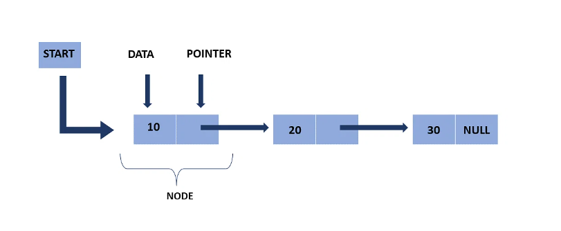
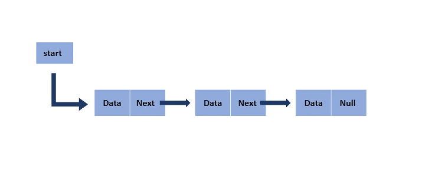
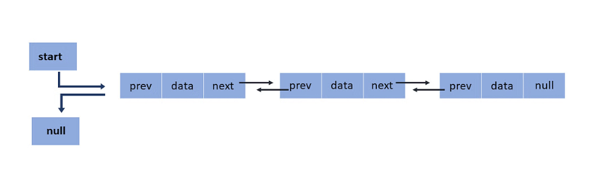
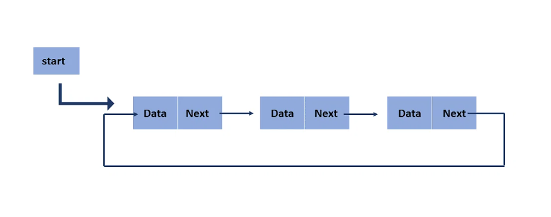

# Linked List (Second Data Structure)

## Introduction to Linked List Data Structure

- **What is a Linked List?**: A linked list is a linear data structure where elements are stored in nodes. Each node contains a data field and a reference (link) to the next node in the sequence.

Here, the start pointer stores the address of the first node, and at the end, there is a null pointer that states the end of the Linked List

- **Purpose of a Linked List**: Linked lists offer dynamic memory allocation and efficient insertion/deletion operations compared to arrays, as they don't require contiguous memory space.

- **Performance (Big O Notation)**: 
  - Access: O(n)
  - Search: O(n)
  - Insertion/Deletion: O(1) (at the beginning or the end with a reference)

## Implementing a Linked List in Python

- **Types of Linked Lists**: 
  - Singly Linked List
  - Doubly Linked List
  - Circular Linked List

**Singly Linked List**: A singly linked list is the most common type of linked list. Each node has data and an address field that contains a reference to the next node.

**Doubly Linked List**: There are two pointer storage blocks in the doubly linked list. The first pointer block in each node stores the address of the previous node. Hence, in the doubly linked inventory, there are three fields that are the previous pointers, that contain a reference to the previous node. Then there is the data, and last you have the next pointer, which points to the next node. Thus, you can go in both directions (backward and forward).

**Circular Linked List**: The circular linked list is extremely similar to the singly linked list. The only difference is that the last node is connected with the first node, forming a circular loop in the circular linked list.

- **Example Python Code**:
  - [Python code for implementing a Singly Linked List](examples/linked-list/singly-linked-list.md)
  - [Python code for implementing a Doubly Linked List](examples/linked-list/doubly-linked-list.md)
  - [Python code for implementing a Circular Linked List](examples/linked-list/circular-linked-list.md)

## Problems Solved Using Linked List

- **First Problem: Finding the Middle Element in a Linked List**:
  - This problem involves finding the middle element/node of a linked list. It can be solved using two pointers - one moving twice as fast as the other.
  - [Link to Solution](solutions/second-data-structure/find-midle-element.py)

- **Second Problem (For Student): Reversing a Linked List**:
  - This problem requires reversing the order of nodes in a linked list.
  - [Link to Solution](solutions/second-data-structure/reverse-a-linked-list.py)
