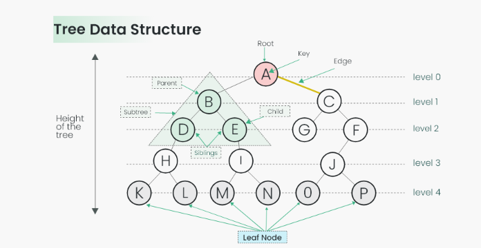
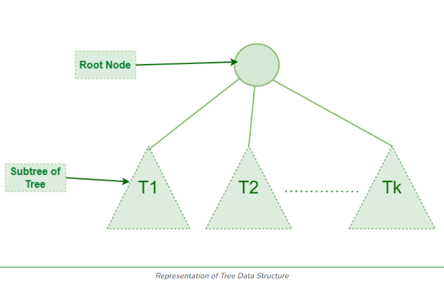
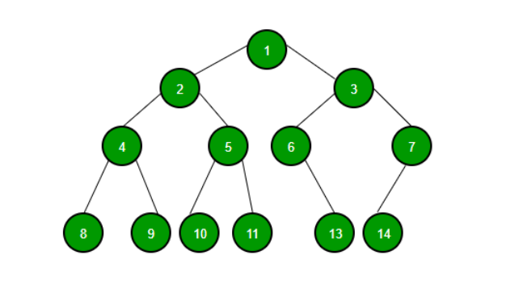
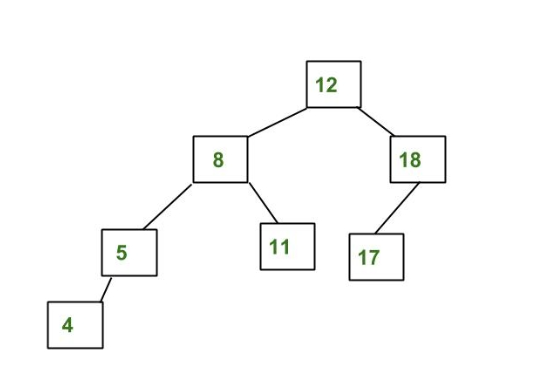
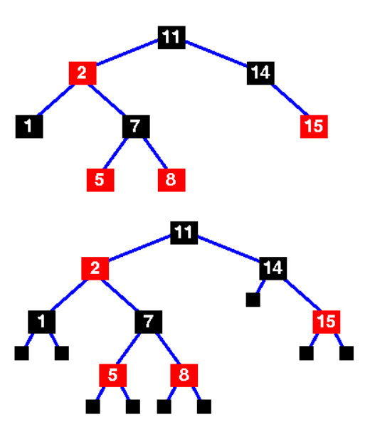

# TREE (Third Data Structure)

## Introduction to Tree Data Structure

### What is a Tree?
A tree is a hierarchical data structure that consists of nodes connected by edges. It is composed of a root node and child nodes linked in a specific arrangement. Each node can have zero or more child nodes. Nodes that have no children are referred to as leaf nodes.

### Purpose of a Tree
Trees are widely used in computer science for organizing and storing data in a hierarchical manner. They facilitate efficient searching, insertion, and deletion operations.

### Performance (Big O Notation)
- **Search:** 
  - O(log n) for balanced trees like AVL, Red-Black; 
  - O(n) for unbalanced trees.
- **Insertion:** 
  - O(log n) for balanced trees; 
  - O(n) for unbalanced trees.
- **Deletion:** 
  - O(log n) for balanced trees; 
  - O(n) for unbalanced trees.

## Implementing a Tree in Python

### Types of Trees
- **Binary Tree:** Each node has at most two children.
- **AVL Tree:** A self-balancing binary search tree maintaining height balance.
- **Red-Black Tree:** A self-balancing binary search tree with constraints on node coloring.

**Binary Tree:**
A Binary Tree is a tree data structure in which each node has at most two children, typically referred to as the left child and right child.

**AVL Tree:**
An AVL Tree is a self-balancing Binary Search Tree where the difference between the heights of left and right subtrees cannot be more than one for all nodes.

**Red-Black Tree:**
A Red-Black Tree is a self-balancing binary search tree where each node has an extra bit for color (red or black) and satisfies specific properties ensuring balanced operations.

-**Example Python Code**:
  - [Python code for implementing a Binary Tree](examples/tree/binary-tree.py)
  - [Python code for implementing a AVL Tree](examples/tree/avl-tree.py)
  - [Python code for implementing a Red-Black Tree](examples/tree/red-black-tree.py)

## Problems Solved Using Trees
- **First Problem: Binary Tree Level Order Traversal**:
  - Given a binary tree, return its level order traversal. Level order traversal of a tree is breadth-first traversal for the tree.
  - [Link to Solution](solutions/third-data-structure/binary-tree-level.py)

- **Second Problem: Validate Binary Search Tree**:
  - Given the root of a binary tree, determine if it is a valid binary search tree (BST).
  - [Link to Solution](solutions/third-data-structure/validate-binary-search-tree.py)